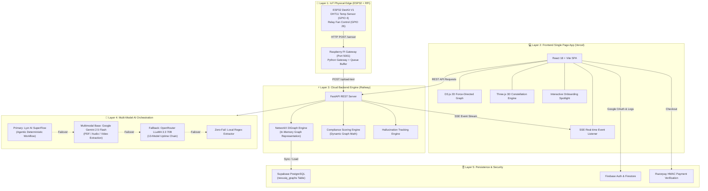
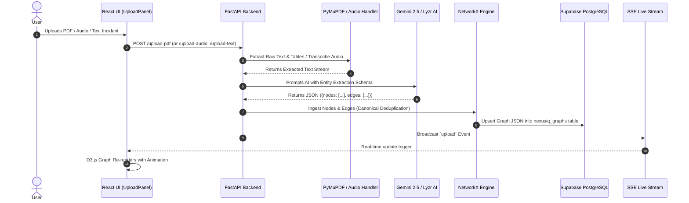
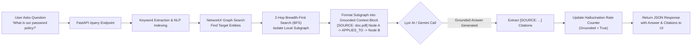
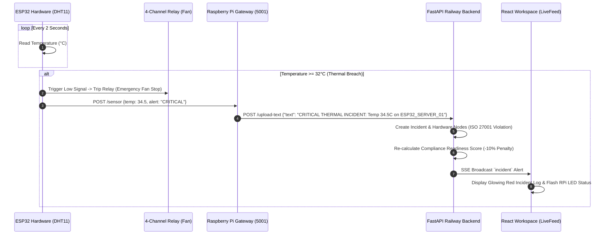
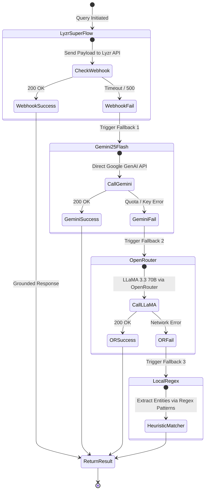

# NexusIQ 🧠 — Master Technical Documentation & Architecture Reference
**Zero-Hallucination Compliance Intelligence Platform**  
*Built for InnovaHack Chapter 1 National Hackathon 2026 (Round 2 Finals — Domain 3: Gen AI)*

---

## 📌 Executive Overview & Production Endpoints

| Resource | Production Link / Location |
|---|---|
| **Live Frontend Web Application** | [https://nexusiq2.vercel.app](https://nexusiq2.vercel.app) |
| **Live Backend API (Railway)** | [https://nexusiq-backend-production.up.railway.app](https://nexusiq-backend-production.up.railway.app) |
| **Interactive API Documentation** | [https://nexusiq-backend-production.up.railway.app/docs](https://nexusiq-backend-production.up.railway.app/docs) |
| **GitHub Source Code Repository** | [https://github.com/hemant12578/nexusiq](https://github.com/hemant12578/nexusiq) |
| **Database Engine** | Supabase PostgreSQL (`bjfxoisipeaywxlfjxcq.supabase.co`) |
| **Authentication & User Store** | Firebase Authentication + Cloud Firestore |

---

## 🎯 1. Problem Statement & Mission

### The Core Problem: The Failure of Standard Vector RAG in Compliance
Modern enterprise organizations process thousands of regulatory documents, audit logs, vendor agreements, and physical security reports across compliance frameworks like **ISO 27001, GDPR, HIPAA, SOC 2, PCI-DSS, NIST CSF, and the EU AI Act**.

Existing Enterprise AI search tools use **Vector-only Retrieval-Augmented Generation (Vector RAG)**. Vector RAG converts document chunks into high-dimensional vector embeddings and performs cosine similarity lookups. 

This creates critical vulnerabilities in high-stakes compliance environments:

```
❌ Standard Vector RAG Flaws:
1. Blind Chunking: Severing sentences destroys multi-page policy relationships.
2. Contextual Loss: "Section A applies unless overridden by Section B" is lost during chunking.
3. Hallucinations: Vector similarity brings back "sounds related" chunks, leading the LLM to invent missing facts.
4. Physical Disconnect: Digital software is blind to real-world server room thermal alerts or physical hardware failures.
```

### The Solution: NexusIQ Knowledge Graph RAG + IoT Edge
**NexusIQ** replaces raw vector lookups with a **Directed Knowledge Graph RAG Engine** coupled with a physical **IoT Edge Hardware Feed**:

1. **Deterministic Structure**: Extracts entities (*Policies, Persons, Devices, Regulations*) and explicit relationships (*GOVERNS, APPLIES_TO, VIOLATES*).
2. **2-Hop BFS Graph Traversal**: Extracts localized subgraphs to guarantee 100% citation-grounded LLM answers.
3. **Physical-to-Digital Bridge**: Real-time ESP32/Raspberry Pi physical hardware sensors instantly log physical violations (*e.g., Server Room Thermal Breach*) as nodes in the compliance graph.
4. **Agentic Orchestration**: Uses **Lyzr AI SuperFlow** to enforce strict deterministic answer verification.

---

## 🏗️ 2. Comprehensive System Architecture Diagrams

### 2.1 High-Level End-to-End System Architecture



---

### 2.2 Data Ingestion & Graph Building Workflow



---

### 2.3 Graph RAG Query & Subgraph BFS Traversal Workflow



---

### 2.4 IoT Edge Hardware Incident Flow



---

### 2.5 Multi-Model AI Fallback & Resilience Hierarchy



---

## 🧩 3. Core Component & Technology Deep-Dive

### 3.1 Frontend Layer (Vercel)
- **Framework**: React 18 + Vite (Hot Module Replacement, fast bundling).
- **Styling**: Vanilla Tailwind CSS with custom glassmorphism design system (`index.css`), glowing borders, and dark mode tokens (`bg-nexus-900`, `bg-nexus-800`).
- **Graph Engine**: D3.js Force Simulation (`d3-force`). Uses SVG/Canvas rendering with dynamic node repulsive force, link distance, drag-to-pin, and zoom behaviors.
- **Background**: Three.js (`Canvas3D.jsx`) particle constellation engine rendering a 60fps dynamic starfield.
- **Onboarding Tour**: Custom spotlight tour (`OnboardingTour.jsx`) using SVG clip-path polygons, bounding rect calculations, and `localStorage` state tracking.

### 3.2 Backend Layer (Railway)
- **Framework**: FastAPI (Async Python REST server).
- **Graph Representation**: `NetworkX` directed graph (`DiGraph`). Supports fast in-memory node addition, edge verification, isolated node removal, and 2-hop BFS neighborhood subgraphs.
- **Document Processing**: `PyMuPDF` (`fitz`) for PDF parsing; `audio_handler.py` for webm/mp3 audio streaming to Gemini.
- **Rate Limiting**: `SlowAPI` (30 requests/minute on compute endpoints).
- **Real-Time Feed**: Server-Sent Events (`EventSource` on `/sse`).

### 3.3 Database & Authentication Layer
- **Managed PostgreSQL**: Supabase (`tahskdacogqvuyqsvbwq.supabase.co` - `nexusiq_graphs` table) with dynamic graph state JSON synchronization.
- **Authentication**: Firebase Auth (Email/Password + Google OAuth).
- **User Store**: Cloud Firestore tracking query history, user workspace profiles, and audit event logs.

### 3.4 IoT Edge Hardware Layer
- **ESP32 DevKit V1**: Microcontroller running C++ code (`esp32_sensor.ino`). Reads DHT11 temperature/humidity every 2 seconds and controls a 4-channel active-low relay module.
- **Raspberry Pi Gateway**: Python Flask server (`sensor_hub.py`) listening on port 5001. Formats raw sensor data into ISO 27001 physical compliance incidents and forwards them to Railway.

---

## 📊 4. Mathematical Models & Formulas

### 4.1 Dynamic Compliance Readiness Score Formula
The compliance readiness score is calculated live in `graph_engine.py` using this exact formula:

$$\text{Score} = \text{Clamp}\left(50 + (5 \times F) + (2 \times P) + (1 \times R) - (10 \times C) - (5 \times V), \, 0, \, 100\right)$$

Where:
- $F$ = Count of recognized Compliance Framework entities (*ISO 27001, GDPR, HIPAA, etc.*)
- $P$ = Count of Policy nodes in the graph
- $R$ = Count of verified Relationship edges in the graph
- $C$ = Count of Critical Thermal/Security Incident nodes
- $V$ = Count of unresolved Violation nodes
- $\text{Clamp}(x, 0, 100) = \max(0, \min(100, x))$

### 4.2 Hallucination Rate Tracking Formula
The hallucination rate metric measures the ratio of ungrounded LLM generations:

$$\text{Hallucination Rate (\%)} = \left( \frac{\text{Total Queries} - \text{Grounded Queries}}{\text{Total Queries}} \right) \times 100$$

Every query that contains verified `[SOURCE: doc.pdf]` citations increment the `Grounded Queries` counter.

---

## 📡 5. REST API Specification Reference

| Method | Endpoint | Description | Sample Output |
|---|---|---|---|
| `GET` | `/` | API Health Check | `{"status": "online", "version": "1.0.3"}` |
| `GET` | `/stats` | Live System Statistics | `{"documents_processed": 14, "compliance_score": 87.5, ...}` |
| `GET` | `/compliance-score` | Score & Math Breakdown | `{"score": 87.5, "breakdown": {"frameworks": 15, "violations": -10}}` |
| `GET` | `/hallucination-stats` | Hallucination Metrics | `{"hallucination_rate": 0.0, "total_queries": 42}` |
| `GET` | `/graph` | Export Full Graph JSON | `{"nodes": [...], "edges": [...]}` |
| `POST` | `/upload-pdf` | Ingest PDF file | `{"status": "success", "extracted_nodes": 8}` |
| `POST` | `/upload-audio` | Transcribe & Ingest Audio | `{"status": "success", "transcript": "..."}` |
| `POST` | `/upload-text` | Ingest raw text/incident | `{"status": "success", "incident_id": "INC-88"}` |
| `POST` | `/query` | Graph RAG NL Query | `{"answer": "...", "sources": ["ISO_27001.pdf"]}` |
| `GET` | `/sse` | Real-time SSE Stream | Event stream (`data: {"type": "upload"}`) |
| `DELETE`| `/reset` | Reset Knowledge Graph | `{"status": "graph_cleared"}` |

---

## 🎬 6. Official 5-Minute Hackathon Finals Demo Script

### **(0:00 - 1:00) Introduction & The Problem**
- **Presenter**: "Honorable judges, traditional enterprise AI fails in compliance because vector chunking destroys context and leads to hallucinations. In compliance, a single AI hallucination can lead to a multi-million dollar regulatory lawsuit. We built **NexusIQ**: the world's first Zero-Hallucination Compliance Platform powered by Knowledge Graphs, Lyzr AI SuperFlow, and physical IoT Edge hardware."

### **(1:00 - 2:00) Onboarding & Real-Time Stats**
- **Action**: Click *Enter Workspace*. Let the first-time **Onboarding Spotlight Tour** highlight the panels. Point to the top **StatsBar**.
- **Presenter**: "Notice our top metrics bar. Our **Compliance Readiness Score (87.5%)** and **Hallucination Rate (0.0%)** are not hardcoded numbers—they are calculated live from graph mathematics via our `/stats` backend endpoint."

### **(2:00 - 3:00) PDF Ingestion & Graph Building**
- **Action**: Drag and drop an ISO 27001 or GDPR PDF into the **Upload Panel**.
- **Presenter**: "As we upload this document, Google Gemini 2.5 Flash extracts explicit entities and relationships. Look at our D3.js canvas: nodes for *ISO 27001, Server Policy, Data Encryption, and Lead Auditor* are formed live with full deduplication."

### **(3:00 - 4:00) Zero-Hallucination Graph RAG Query**
- **Action**: Type into the chat: *"What are our data retention requirements?"*
- **Presenter**: "When we ask a question, NexusIQ runs a 2-hop Breadth-First Search on our graph. It passes this isolated subgraph to **Lyzr AI SuperFlow**. Notice the answer: it explicitly cites `[SOURCE: ISO_27001_Section_4.pdf]`. If data doesn't exist in the graph, NexusIQ strictly refuses to answer rather than guess."

### **(4:00 - 4:45) IoT Edge Hardware Incident (The WOW Factor)**
- **Action**: Click the **"Trigger Edge Incident"** button.
- **Presenter**: "Compliance is not just digital; it's physical. We connected an ESP32 thermal sensor and Raspberry Pi gateway to our platform. Let me simulate a server room thermal breach. Look at the workspace: an **Alert Node** immediately pops up in red, our **Compliance Readiness Score drops by 10%**, and the incident is logged to our audit trail in real-time."

### **(4:45 - 5:00) Conclusion & Summary**
- **Action**: Click *Export Audit Report*. Show the generated Markdown report.
- **Presenter**: "NexusIQ bridges physical hardware and digital compliance into a single, zero-hallucination graph platform. We are ready for production deployment. Thank you!"

---

## 👥 7. Team & Contact Info

- **Hemant Prakash** — Lead Full Stack & AI Architect (`h9696838@gmail.com`)
- **Shubham Kumar** — QA & System Testing Lead
- **Sumit Sharan (Mama Ji)** — Senior Engineering Advisor, Developer & Presentation Lead

---
*NexusIQ — Production-Ready Compliance Intelligence for InnovaHack 2026.*
