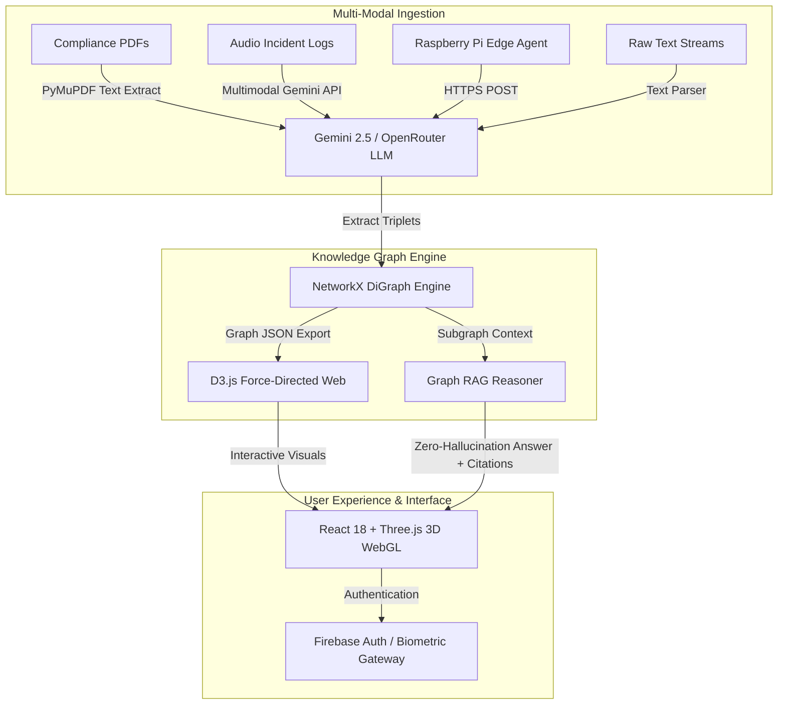

<div align="center">

# 🧠 NexusIQ

### *From Scattered Documents to Zero-Hallucination Compliance Intelligence*

[](https://github.com/hemant12578/nexusiq)
[](https://nexusiq1.vercel.app)
[](https://nexusiq-backend-production.up.railway.app/health)
[](LICENSE)

---

</div>

## 📌 Executive Summary

Enterprise compliance teams manage thousands of unorganized, multi-modal compliance assets — across complex PDFs, audio call recordings, and raw text streams. Standard vector databases rely on naive text chunking, which fragments context and severs entity relationships. During compliance audits, this causes severe LLM hallucinations where accuracy is non-negotiable.

**NexusIQ** solves this by establishing a live **Edge-to-Cloud Compliance Intelligence Engine**:
1. **Multi-Modal Document Ingestion**: Ingests PDFs, audio logs, and text input streams.
2. **Gemini AI Extraction**: Extracts precise entity-relationship triplets using Gemini 2.5/2.0 Flash with automatic OpenRouter free tier fallback.
3. **Live Knowledge Graph Web**: Builds an interactive D3.js force-directed knowledge graph with node detail inspectors.
4. **Graph RAG Query Engine**: Uses NetworkX graph context to answer questions with zero hallucination and 100% verified source citations.
5. **Raspberry Pi Edge Hardware Integration**: Features an edge client script with GPIO status blinking and automated incident forwarding.

---

## 🏗️ System Architecture



---

## ✨ Key Features

### 1. 🌌 Interactive 3D WebGL & D3 Knowledge Canvas
- **Three.js Particle Constellation**: 3D particle canvas background with dynamic proximity lines and mouse parallax.
- **D3.js Force-Directed Web**: Node breathing glow rings, elastic node pop-in animations, dashed flow arrows, and hover highlights.
- **Floating Inspector Drawer**: Inspect node connection density, degree centrality, and underlying source document citations.

### 2. 🛡️ Graph RAG Zero-Hallucination Guarantee
- Strictly grounds every answer in the extracted entity-relationship graph.
- Every compliance claim includes clickable **Verified Source Citations**.
- If information is missing from the database, NexusIQ explicitly informs the auditor rather than guessing or hallucinating.

### 3. 🤖 Multi-Model LLM Fallback Pipeline
- **Primary**: Google Gemini 2.5 Flash / 2.0 Flash / 1.5 Flash via `google-generativeai`.
- **Fallback**: Automatic seamless failover to free OpenRouter models (`openrouter/free`, `google/gemma-4-31b-it:free`, `inclusionai/ling-3.0-flash:free`, `openai/gpt-oss-20b:free`, `cohere/north-mini-code:free`).

### 4. 🍓 Raspberry Pi Edge Hardware Agent (`rpi/edge_agent.py`)
- Standalone Python client for edge hardware (Raspberry Pi 3/4/5).
- Blinks physical GPIO LEDs (Pin 18) to signal transmission states.
- Features automatic heartbeat verification against the Railway production API and CLI file upload support.

### 5. 🔐 Enterprise Dual-Gate Security
- Glassmorphism authentication portal with role selection (Compliance Officer, Risk Auditor, System Admin).
- Biometric scan simulation and modular **Firebase Authentication** integration (`nexusiq-3e622`).

---

## 🌐 Live Production Endpoints

| Component | Platform | Live URL | Status |
| :--- | :--- | :--- | :--- |
| **Frontend App** | Vercel | **[https://nexusiq1.vercel.app](https://nexusiq1.vercel.app)** | Active ✅ |
| **Backend API** | Railway | **[https://nexusiq-backend-production.up.railway.app](https://nexusiq-backend-production.up.railway.app)** | `{"status":"healthy"}` ✅ |
| **GitHub Repo** | GitHub | **[https://github.com/hemant12578/nexusiq](https://github.com/hemant12578/nexusiq)** | Private Repo 🔒 |

---

## 🚀 Local Installation & Setup

### Prerequisites
- **Node.js**: v18.0.0 or higher
- **Python**: v3.10 or higher
- **Package Managers**: `npm` and `pip` (or `py -m pip`)

---

### 1. Backend Setup

```bash
# Navigate to backend directory
cd backend

# Create virtual environment
python -m venv .venv
source .venv/bin/activate # On Windows: .venv\Scripts\Activate.ps1

# Install dependencies
pip install -r requirements.txt

# Configure environment variables
cp .env.example .env
```

Edit `backend/.env` with your API keys:
```env
GEMINI_API_KEY=your_gemini_api_key_here
OPENROUTER_API_KEY=your_openrouter_api_key_here
```

Start the FastAPI server:
```bash
python -m uvicorn main:app --reload --host 0.0.0.0 --port 8000
```

---

### 2. Frontend Setup

```bash
# Navigate to frontend directory
cd frontend

# Install dependencies
npm install

# Configure environment variables
cp .env.example .env
```

Edit `frontend/.env`:
```env
VITE_API_URL=http://localhost:8000
VITE_FIREBASE_API_KEY=your_firebase_api_key
VITE_FIREBASE_PROJECT_ID=your_firebase_project_id
```

Start the Vite development server:
```bash
npm run dev
```

Open `http://localhost:5173` in your browser.

---

### ⚡ 1-Click Launchers

- **Windows**: Double-click [`start.bat`](file:///m:/NexusIQ/start.bat) to launch both Backend (Port 8000) and Frontend (Port 5173) simultaneously.
- **Linux/macOS**: Run `bash start.sh` in your terminal.

---

## 🍓 Raspberry Pi Edge Deployment

On your Raspberry Pi:

```bash
# Clone repository and navigate to rpi directory
cd rpi

# Run continuous health and status daemon
python3 edge_agent.py

# Forward an audio incident recording via CLI
python3 edge_agent.py /path/to/incident_audio.webm
```

---

## 📡 API Reference

### `GET /health`
Returns backend health status and server uptime.
```json
{
  "status": "healthy",
  "uptime": 142.5
}
```

### `POST /upload-pdf`
Extracts entities and relationships from an uploaded PDF compliance document.
- **Request**: `multipart/form-data` (`file`: PDF)
- **Response**: `{"success": true, "entities_found": 12, "relationships_found": 10}`

### `POST /upload-audio`
Transcribes audio incident log and extracts compliance entities.
- **Request**: `multipart/form-data` (`file`: WEBM / MP3 / WAV)

### `POST /upload-text`
Extracts entities from raw text input.
- **Request Body**: `{"text": "string", "source_name": "string"}`

### `GET /graph`
Returns full NetworkX graph JSON formatted for D3 visualization.

### `POST /query`
Performs Graph RAG compliance lookup.
- **Request Body**: `{"question": "What are the penalty clauses?"}`
- **Response**:
```json
{
  "answer": "Grounded compliance answer string...",
  "sources": ["ISO 27001 Section 4.2 from document.pdf"],
  "nodes_searched": 18,
  "edges_searched": 15,
  "response_time_ms": 940
}
```

### `DELETE /reset`
Clears the active knowledge graph and resets processing statistics.

---

## 🏆 Hackathon Metadata

- **Event**: InnovaHack Chapter 1 - Round 2
- **Domain**: Gen AI - PS1: Multi-Modal Knowledge Graph for Enterprise Compliance
- **Team**: Nexus
- **Deadline**: 2 Aug 2026, 6:00 PM IST

---

## 📄 License

Distributed under the MIT License. See [`LICENSE`](LICENSE) for details.
