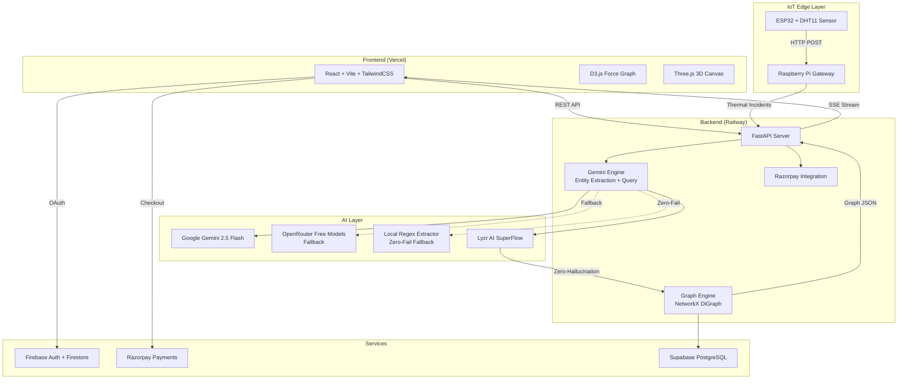

# NexusIQ 🧠
### Zero-Hallucination Compliance Intelligence Platform


🔗 **[Live Demo](https://nexus-iq-drab.vercel.app)** | 📡 **[API Docs](https://nexusiq-backend-production.up.railway.app/docs)** | 🐙 **[GitHub](https://github.com/hemant12578/nexusiq)** | 🏆 **InnovaHack 2026 • Domain 3: Gen AI**

---

## 📋 Table of Contents

- [Overview](#-overview)
- [Key Features](#-key-features)
- [System Architecture](#-system-architecture)
- [Tech Stack](#-tech-stack)
- [IoT Edge Pipeline](#-iot-edge-pipeline)
- [Getting Started](#-getting-started)
- [Environment Variables](#-environment-variables)
- [API Reference](#-api-reference)
- [Project Structure](#-project-structure)
- [Security](#-security)
- [Team](#-team)
- [License](#-license)

---

## 🔍 Overview

Modern enterprises are drowning in unstructured compliance documents — PDFs, audit reports, audio recordings, video transcripts. Traditional RAG systems chunk text blindly, severing critical relationships and producing hallucinated answers.

**NexusIQ** solves this with a **Knowledge Graph RAG** architecture:

1. **Ingest** → Multi-modal documents (PDF, audio, video, text) are processed through Google Gemini 2.5 Flash
2. **Extract** → AI extracts structured entities and relationships with cross-document deduplication
3. **Build** → A live NetworkX directed graph maintains explicit entity connections
4. **Query** → 2-hop BFS subgraph retrieval provides grounded context to the LLM
5. **Answer** → Every response is cited, traceable, and hallucination-resistant

**Lyzr AI SuperFlow Integration**: To ensure absolute deterministic behavior in high-stakes compliance scenarios, NexusIQ integrates Lyzr AI SuperFlow for agentic orchestration. Lyzr's multi-agent workflows coordinate the ingestion, validation, and querying pipelines, guaranteeing zero-hallucination responses by anchoring the LLM generation entirely on extracted graph assertions rather than parametric memory.

> 💡 Unlike vector-only RAG, NexusIQ maintains **explicit entity relationships**, ensuring answers are grounded in graph reality rather than fuzzy similarity matches.

---

## ✨ Key Features

| Feature | Description |
|---------|-------------|
| 📄 **Multi-Format Ingestion** | PDF, Audio (WebM/MP3), Video (MP4/MOV), and raw text processing |
| 🤖 **AI Entity Extraction** | Google Gemini 2.5 Flash with intelligent multi-model fallback (OpenRouter → Regex) |
| 🤖 **Lyzr AI SuperFlow** | Agentic orchestration for deterministic compliance workflows |
| 🕸️ **Interactive Knowledge Graph** | Real-time 2D (D3.js) and 3D (Three.js) force-directed visualization |
| 💬 **Natural Language Queries** | Graph RAG-powered Q&A with source citations and confidence scoring |
| 🛡️ **Zero-Hallucination Design** | Strict graph-only answers — refuses to fabricate when data is missing |
| 📊 **Compliance Audit Reports** | Auto-generated markdown reports with risk assessment |
| 🗄️ **Supabase Persistence** | Managed PostgreSQL for knowledge graph storage with local JSON fallback |
| 🔌 **IoT Edge Integration** | ESP32 DHT11 sensor → Raspberry Pi gateway → Cloud backend pipeline |
| 💳 **Payment Integration** | Razorpay Standard Checkout for tiered subscriptions |
| 🔐 **Firebase Auth** | Email/Password + Google OAuth with Firestore user profiles |
| 📡 **Real-time SSE Feed** | Server-Sent Events for live ingestion monitoring |

---

## 🏗️ System Architecture



---

## 🛠️ Tech Stack

### Frontend
| Technology | Purpose |
|---|---|
| React 18 + Vite | SPA framework with HMR |
| TailwindCSS | Utility-first styling with glassmorphism theme |
| D3.js | 2D force-directed knowledge graph visualization |
| Three.js | 3D particle constellation backgrounds |
| Lucide Icons | Consistent icon system |
| Axios | HTTP client with error handling |

### Backend
| Technology | Purpose |
|---|---|
| FastAPI | Async Python REST API |
| Google Gemini 2.5 Flash | Multi-modal entity extraction & querying |
| Lyzr AI SuperFlow | Agentic orchestration for zero-hallucination compliance |
| NetworkX | Directed graph engine with BFS/PageRank |
| SlowAPI | Rate limiting (30 req/min) |
| PyMuPDF (fitz) | PDF text extraction |
| Razorpay SDK | Payment order creation & verification |

### Infrastructure
| Service | Purpose |
|---|---|
| Vercel | Frontend deployment with SPA routing |
| Railway | Backend deployment with auto-scaling |
| Firebase Auth | Email/Password + Google OAuth |
| Firestore | User profiles, subscriptions, audit logs |
| Supabase | Managed PostgreSQL database for graph storage |

### IoT Edge
| Component | Purpose |
|---|---|
| ESP32 | DHT11 temperature/humidity sensor node |
| Raspberry Pi | Edge gateway with offline queue |
| Relay Module | Active-LOW fan control at 32°C threshold |

---

## 🌡️ IoT Edge Pipeline

```
ESP32 (DHT11 Sensor)
    │
    ├── Reads temperature & humidity every 2s
    ├── If temp ≥ 32°C → Triggers relay (stops fan)
    │                   → Sends CRITICAL to RPi
    └── Every 10s → Sends routine data to RPi
          │
          ▼
Raspberry Pi Gateway (port 5001)
    │
    ├── Receives ESP32 POST /sensor
    ├── If shutdown=true → Sends thermal compliance
    │                      incident to cloud backend
    ├── Offline queue (JSON) for network failures
    └── Manual ENTER trigger for incident simulation
          │
          ▼
NexusIQ Cloud Backend (Railway)
    │
    ├── POST /upload-text → Graph RAG ingestion
    ├── SSE /sse → Real-time feed to frontend
    └── Entity extraction → Knowledge Graph update
```

---

## 🚀 Getting Started

### Prerequisites
- Node.js v18+
- Python 3.9+
- Google Gemini API Key ([Google AI Studio](https://aistudio.google.com/))
- Firebase Project
- Razorpay Account (optional, for payments)

### Quick Start

```bash
# Clone the repository
git clone https://github.com/hemant12578/nexusiq.git
cd nexusiq

# Frontend setup
cd frontend
npm install
cp .env.example .env    # Add your Firebase keys
npm run dev             # Starts on http://localhost:5173

# Backend setup (new terminal)
cd backend
python -m venv venv
source venv/bin/activate    # Windows: venv\Scripts\activate
pip install -r requirements.txt
cp .env.example .env        # Add your API keys
uvicorn main:app --reload   # Starts on http://localhost:8000
```

Or use the launcher scripts:
```bash
# Windows
start.bat

# Linux / macOS
chmod +x start.sh && ./start.sh
```

---

## 🔑 Environment Variables

### Backend (`backend/.env`)
| Variable | Required | Description |
|---|---|---|
| `GEMINI_API_KEY` | ✅ | Google Gemini API key |
| `OPENROUTER_API_KEY` | Optional | OpenRouter free model fallback |
| `RAZORPAY_KEY_ID` | Optional | Razorpay key ID for payments |
| `RAZORPAY_KEY_SECRET` | Optional | Razorpay secret for payment verification |
| `LYZR_WEBHOOK_URL` | Optional | Lyzr SuperFlow webhook endpoint |
| `LYZR_API_KEY` | Optional | Lyzr API authentication key |
| `SUPABASE_URL` | Optional | Supabase project URL for managed persistence |
| `SUPABASE_KEY` | Optional | Supabase service role key |

### Frontend (`frontend/.env`)
| Variable | Required | Description |
|---|---|---|
| `VITE_API_URL` | Optional | Backend API URL (defaults to production Railway) |
| `VITE_FIREBASE_API_KEY` | ✅ | Firebase Web API key |
| `VITE_FIREBASE_AUTH_DOMAIN` | ✅ | Firebase Auth domain |
| `VITE_FIREBASE_PROJECT_ID` | ✅ | Firebase project ID |
| `VITE_RAZORPAY_KEY_ID` | Optional | Razorpay publishable key |

> ⚠️ **Security**: Never commit `.env` files. Use `.env.example` as a template.

---

## 📡 API Reference

| Endpoint | Method | Description |
|---|---|---|
| `/` | GET | Health check & version info |
| `/health` | GET | Uptime status |
| `/upload-pdf` | POST | Upload PDF for entity extraction |
| `/upload-text` | POST | Upload raw text/incidents |
| `/upload-audio` | POST | Upload audio for transcription + extraction |
| `/upload-video` | POST | Upload video for processing |
| `/upload-batch` | POST | Batch upload multiple PDFs |
| `/graph` | GET | Get full knowledge graph (nodes + edges) |
| `/query` | POST | Natural language query against graph |
| `/ask-compliance` | POST | Lyzr-powered compliance query endpoint |
| `/stats` | GET | Platform statistics |
| `/report` | GET | Generate compliance audit report |
| `/export-graph` | GET | Export graph as JSON download |
| `/sse` | GET | Server-Sent Events live feed |
| `/create-order` | POST | Create Razorpay payment order |
| `/verify-payment` | POST | Verify Razorpay payment signature |
| `/reset` | DELETE | Reset knowledge graph |

Full interactive docs: **[Swagger UI](https://nexusiq-backend-production.up.railway.app/docs)**

---

## 📁 Project Structure

```
NexusIQ/
├── frontend/                   # React + Vite SPA
│   ├── src/
│   │   ├── components/         # Reusable UI components
│   │   │   ├── Header.jsx      # Navigation + audit report
│   │   │   ├── GraphView.jsx   # D3.js knowledge graph
│   │   │   ├── QueryInterface.jsx  # NL query panel
│   │   │   ├── UploadPanel.jsx # Multi-format upload
│   │   │   ├── LiveFeed.jsx    # SSE real-time feed
│   │   │   ├── StatsBar.jsx    # Animated metrics
│   │   │   ├── Canvas3D.jsx    # Three.js background
│   │   │   ├── NodeDetail.jsx  # Graph node inspector
│   │   │   ├── LoginPage.jsx   # Firebase auth
│   │   │   └── LandingPage.jsx # Marketing homepage
│   │   ├── pages/              # Route-level pages
│   │   │   ├── Workspace.jsx   # Main dashboard
│   │   │   ├── AboutPage.jsx   # Team & architecture
│   │   │   ├── ArchitecturePage.jsx
│   │   │   ├── PricingPage.jsx # Razorpay checkout
│   │   │   └── NotFoundPage.jsx
│   │   ├── services/
│   │   │   └── firestoreService.js  # Firestore CRUD
│   │   ├── firebase.js         # Firebase config
│   │   ├── App.jsx             # Root router
│   │   └── index.css           # Global styles
│   └── package.json
│
├── backend/                    # FastAPI Python API
│   ├── main.py                 # API endpoints + middleware
│   ├── gemini_engine.py        # AI extraction + query engine
│   ├── graph_engine.py         # NetworkX graph operations
│   ├── audio_handler.py        # Audio format utilities
│   ├── requirements.txt
│   └── .env.example
│
├── rpi/                        # Raspberry Pi edge scripts
│   ├── sensor_hub.py           # ESP32 gateway + cloud sync
│   ├── nexusiq_edge.py         # Standalone incident simulator
│   └── edge_agent.py           # GPIO + offline queue agent
│
├── esp32/                      # ESP32 Arduino firmware
│   ├── esp32_sensor.ino        # DHT11 + relay control
│   └── README.md               # Wiring & library guide
│
├── start.bat                   # Windows launcher
├── start.sh                    # Linux/macOS launcher
├── vercel.json                 # Vercel deployment config
├── firebase.json               # Firebase hosting config
└── README.md                   # This file
```

---

## 🔐 Security

- All API keys are loaded from environment variables — **no hardcoded secrets**
- `.env` files are excluded via `.gitignore`
- Firebase Auth handles user authentication with Google OAuth
- Razorpay payments use HMAC-SHA256 signature verification
- Rate limiting (30 req/min) prevents API abuse
- CORS configured for production domains

---

## 👥 Team

**Team Nexus** — InnovaHack 2026

| Member | Role |
|---|---|
| **Hemant Prakash** | Lead Full Stack & AI Architect |
| **Shubham Kumar** | QA & System Testing |
| **Sumit Sharan** | Professional Developer |

Contact: h9696838@gmail.com

---

## 🤝 Contributing

1. Fork the Project
2. Create your Feature Branch (`git checkout -b feature/AmazingFeature`)
3. Commit your Changes (`git commit -m 'Add AmazingFeature'`)
4. Push to the Branch (`git push origin feature/AmazingFeature`)
5. Open a Pull Request

---

## 📄 License

This project is licensed under the MIT License — see the [LICENSE](LICENSE) file for details.

---

<p align="center">
  <strong>Built with ❤️ for InnovaHack 2026</strong><br>
  Domain 3: Gen AI · Powered by Lyzr AI SuperFlow & Google Gemini
</p>
