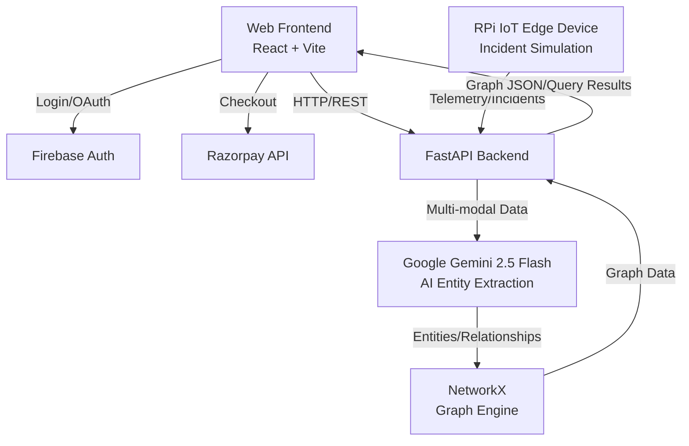

# NexusIQ 🧠


**NexusIQ** is an AI-powered compliance intelligence platform designed to extract, analyze, and visualize complex relationships from diverse data sources to streamline compliance audits and risk management.

🔗 **[Live Demo](https://nexus-iq-drab.vercel.app)** | 🔗 **[Backend API](https://nexusiq-backend-production.up.railway.app)**

---

## ✨ Key Features

- 📄 **Multi-Format Document Upload:** Ingest data from PDFs, audio, video, and text sources.
- 🤖 **AI Entity Extraction:** Powered by Google Gemini 2.5 Flash with intelligent multi-model fallback for robust extraction.
- 🕸️ **Interactive Knowledge Graph:** Real-time 2D/3D graph visualization using D3.js and Three.js force-directed layouts.
- 💬 **Natural Language Querying:** Ask questions against your compliance data and get cited, verifiable answers.
- 📊 **Compliance Audit Reports:** Automatically generate comprehensive audit reports.
- 🛡️ **Hallucination Detection:** Built-in confidence scoring and hallucination detection for AI responses.
- 🔌 **IoT Edge Integration:** RPi IoT edge device incident simulation.
- 💳 **Seamless Payments:** Integrated Razorpay Standard Checkout for premium features.

## 🛠️ Tech Stack

### Frontend
- **Framework:** React + Vite
- **Visualization:** D3.js (Force Graph), Three.js (3D Canvas)
- **UI & Icons:** Lucide Icons
- **Deployment:** Vercel

### Backend
- **Framework:** Python FastAPI
- **AI Engine:** Google Gemini 2.5 Flash
- **Graph Processing:** NetworkX
- **Deployment:** Railway

### Infrastructure & Services
- **Authentication:** Firebase (Email/Password + Google OAuth)
- **Payments:** Razorpay Standard Checkout

---

## 🏗️ System Architecture



---

## 📸 Screenshots

| Dashboard | Knowledge Graph |
|-----------|-----------------|
| *Screenshot coming soon* | *Screenshot coming soon* |

| Audit Report | Query Interface |
|--------------|-----------------|
| *Screenshot coming soon* | *Screenshot coming soon* |

---

## 🚀 Quick Start

### Prerequisites
- Node.js (v18+)
- Python (3.9+)
- Firebase Project
- Razorpay Account
- Google Gemini API Key

### Frontend Setup
```bash
# Clone the repository
git clone https://github.com/yourusername/NexusIQ.git
cd NexusIQ/frontend

# Install dependencies
npm install

# Set up environment variables
cp .env.example .env
# Add your Firebase and Razorpay keys to .env

# Start development server
npm run dev
```

### Backend Setup
```bash
cd ../backend

# Create virtual environment
python -m venv venv
source venv/bin/activate  # On Windows use `venv\Scripts\activate`

# Install dependencies
pip install -r requirements.txt

# Set up environment variables
cp .env.example .env
# Add your Gemini API key and other secrets to .env

# Start FastAPI server
uvicorn main:app --reload
```

---

## 📖 API Documentation Summary

The backend exposes a comprehensive RESTful API documented automatically via Swagger UI. Once the backend is running, visit `http://localhost:8000/docs` (or the [production backend URL](https://nexusiq-backend-production.up.railway.app/docs)) to explore endpoints.

**Key Endpoints:**
- `POST /api/upload`: Upload multi-format documents for processing.
- `GET /api/graph`: Retrieve the current state of the knowledge graph.
- `POST /api/query`: Submit a natural language query against the graph data.
- `GET /api/report`: Generate and download compliance audit reports.
- `POST /api/simulate-incident`: Endpoint for RPi IoT edge device simulations.

---

## 👥 Team Nexus

1. **Hemant Prakash** — Lead Full Stack & AI Architect
2. **Shubham Kumar** — QA & System Testing

---

## 🤝 Contributing

We welcome contributions to NexusIQ! 

1. Fork the Project
2. Create your Feature Branch (`git checkout -b feature/AmazingFeature`)
3. Commit your Changes (`git commit -m 'Add some AmazingFeature'`)
4. Push to the Branch (`git push origin feature/AmazingFeature`)
5. Open a Pull Request

---

## 📄 License

This project is licensed under the MIT License - see the [LICENSE](LICENSE) file for details.
